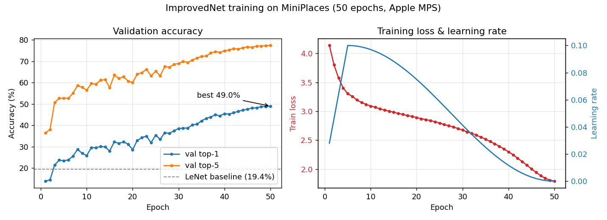
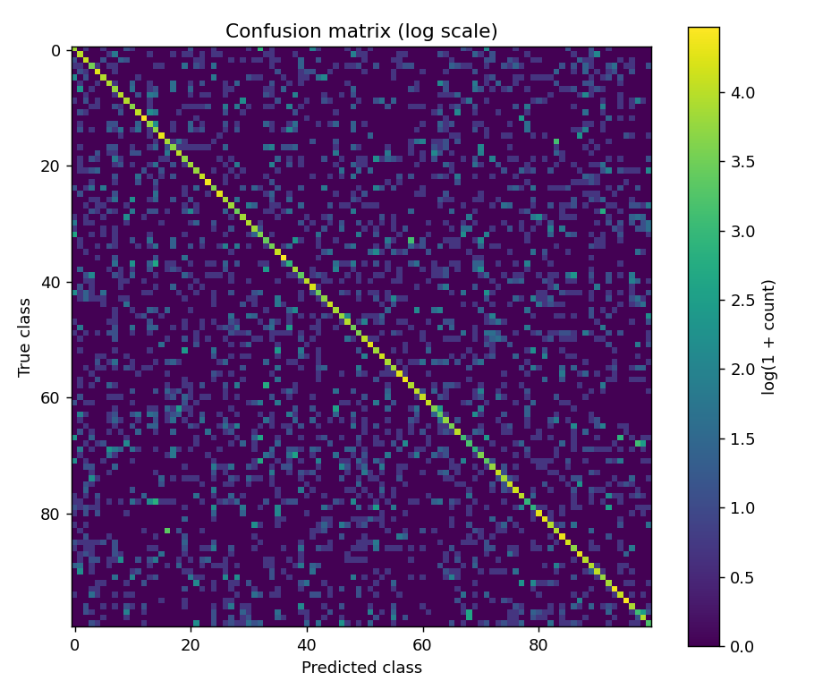
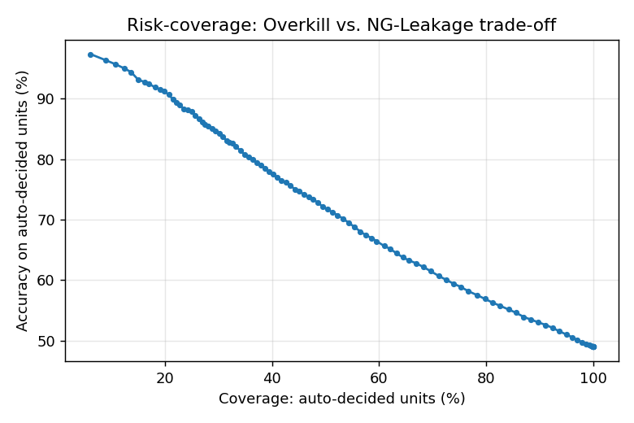

# SceneScope: CNN Detection-Power Analysis

Scene recognition on the **MiniPlaces** dataset (100 classes, 32×32 images). The
project starts from a **LeNet-5 baseline** (course assignment) and adds a
**custom CIFAR-style ResNet (`ImprovedNet`)** that improves validation **top-1
accuracy from 19.4% to 49.0% — a 2.5× gain** (77.4% top-5). The trained model is
then analyzed as a **vision inspection / detection system** (precision/recall,
confusion analysis, and a false-reject vs. missed-detection operating-point sweep).

**Stack:** Python · PyTorch · NumPy · Matplotlib · Apple Silicon GPU (MPS)

> The LeNet-5 baseline is the original course assignment. **The `ImprovedNet`
> model, the training/evaluation pipeline, and the inspection-oriented analysis
> are my own extensions** beyond the assignment scope.

## Results

| Model | val top-1 | val top-5 | macro P / R / F1 | params |
|-------|:---:|:---:|:---:|:---:|
| LeNet-5 baseline (best config) | 19.4% | — | — | 0.15M |
| **ImprovedNet (custom ResNet)** | **49.0%** | **77.4%** | **49.3 / 49.0 / 48.9%** | 2.8M |



*Left: validation accuracy climbs past the LeNet baseline as the cosine schedule
anneals the learning rate. Right: training loss and the warmup→cosine LR schedule.*

## Models

### Baseline — LeNet-5 (`student_code.py`)
The graded assignment: two conv layers + three fully-connected layers with ReLU
and max pooling, ~0.15M parameters. Left unmodified.

### ImprovedNet — custom CIFAR-style ResNet (`improved_model.py`)
A compact residual network (~2.8M params) tuned for small 32×32 inputs:
- 3×3 stem (no early downsampling — preserves 32×32 detail)
- 3 residual stages (64 → 128 → 256 channels) with batch normalization
- global average pooling + dropout + linear classifier

**Training recipe** (`train_improved.py`): SGD + momentum, **warmup → cosine
learning-rate schedule**, data augmentation (random crop + flip), label smoothing,
and weight decay. Trained on **Apple Silicon GPU (PyTorch MPS)**, ~66 min / 50 epochs.

## Inspection-oriented analysis

See **[`INSPECTION_ANALYSIS.md`](INSPECTION_ANALYSIS.md)** for the full write-up.
Highlights:
- **Detection power:** per-class precision/recall/F1; strongest/weakest classes.
- **Failure analysis:** most-confused pairs are semantically similar scenes
  (e.g. `shower↔bathroom`, `abbey→church`) — the analog of confusable defect types.
- **Operating point:** sweeping the confidence threshold trades false rejects
  (overkill) against missed detections (NG leakage) — e.g. a high-confidence
  setting reaches 91.5% auto-decision accuracy at 8.5% leakage.

| Confusion matrix | Risk–coverage (overkill vs. leakage) |
|---|---|
|  |  |

## Dataset

MiniPlaces (subset of MIT Places2): **100K** train / **10K** val / **10K** test
images across 100 scene categories, downsampled to 32×32. Labels exist for train
and val; the test set is unlabeled (challenge holdout), so evaluation uses val.

## Setup & reproduce

This project uses an isolated [`uv`](https://docs.astral.sh/uv/) virtual
environment (nothing is installed system-wide):

> ⚠️ The dataset (`data.tar.gz`, ~439 MB) is **not included** in this repository —
> download it from the [MiniPlaces source](https://github.com/CSAILVision/miniplaces)
> before running step 2.

```bash
# 1. Isolated env + dependencies (Python 3.12 + PyTorch with MPS)
uv venv --python 3.12 .venv
uv pip install --python .venv/bin/python torch torchvision tqdm matplotlib

# 2. Dataset: extract images and fetch label files
mkdir -p data/miniplaces
tar -xzf data.tar.gz -C data images
mv data/images/train data/images/val data/images/test data/miniplaces/ && rmdir data/images
curl -fsSL https://raw.githubusercontent.com/CSAILVision/miniplaces/master/data/train.txt -o data/miniplaces/train.txt
curl -fsSL https://raw.githubusercontent.com/CSAILVision/miniplaces/master/data/val.txt   -o data/miniplaces/val.txt

# 3. Train, evaluate, and analyze
.venv/bin/python train_improved.py --epochs 50
.venv/bin/python inspection_eval.py
.venv/bin/python plot_history.py
```

## File structure

```
├── student_code.py          # LeNet-5 baseline (graded assignment)
├── improved_model.py        # ImprovedNet: custom CIFAR-style ResNet
├── train_improved.py        # Training + evaluation (MPS, augmentation, cosine LR)
├── inspection_eval.py       # Detection metrics + operating-point analysis
├── plot_history.py          # Training-curve figure
├── INSPECTION_ANALYSIS.md   # Inspection-oriented write-up
├── dataloader.py            # MiniPlaces dataloader (provided)
├── train_miniplaces.py      # Baseline training script (provided)
├── eval_miniplaces.py       # Baseline evaluation script (provided)
└── outputs/                 # Metrics + figures (model checkpoints are gitignored)
```

## Limitations & next steps

- At 32×32, top-1 (~49%) is near the practical ceiling — comparable to
  full-resolution ResNet-34 baselines (~50%). Larger gains require higher input
  resolution or transfer learning, not more epochs.
- Evaluation uses the labeled validation split; the MiniPlaces test set is an
  unlabeled challenge holdout.
- Next steps: higher-resolution inputs, a pretrained backbone (transfer learning),
  stronger augmentation (Cutout/Mixup), and test-time augmentation.

## References

- **LeNet-5** — LeCun et al., *Gradient-Based Learning Applied to Document Recognition*, 1998.
- **ResNet** — He et al., *Deep Residual Learning for Image Recognition*, 2015.
- **MiniPlaces / Places** — Zhou et al., *Places: A 10 Million Image Database for Scene Recognition*.
- **PyTorch** — https://pytorch.org/docs/stable/index.html
